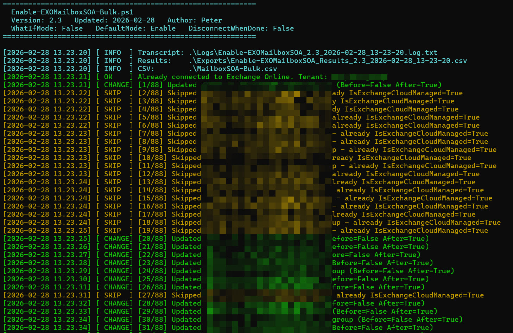
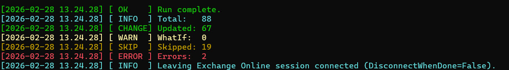

# Enable-EXOMailboxSOA-Bulk.ps1

Bulk enable/disable **Exchange mailbox SOA** (Source of Authority) for directory-synchronized mailboxes in **Exchange Online**, based on a CSV input file.

In hybrid environments, some Exchange mailbox attributes can be managed either from **on-premises** or from **Exchange Online**. This script helps you **switch the mailbox attribute SOA** to/from cloud management in a controlled, logged, repeatable way across many mailboxes.

---

## What this script is for

If you are:

- Running **hybrid** with directory synchronization (Entra Connect / AAD Connect / Cloud Sync)
- Migrating mailboxes to Exchange Online
- Working toward “**last Exchange server**” retirement
- Wanting to manage certain Exchange attributes **in the cloud** instead of on-prem

…then you may need to set the mailbox flag that controls whether Exchange Online is the **source of authority** for mailbox attributes.

This script bulk-updates that mailbox flag using a CSV list, which makes it handy if you want to update for a lot of mailboxes.

---

## What it does

For each row in your CSV, the script:

1. Loads the mailbox with `Get-Mailbox`
2. Checks:
   - `IsDirSynced` must be `True` (otherwise the row is skipped)
   - current `IsExchangeCloudManaged` state
3. If change is needed, sets:
   - **Enable:** `Set-Mailbox -IsExchangeCloudManaged $true`
   - **Disable:** `Set-Mailbox -IsExchangeCloudManaged $false`
4. Logs:
   - Updates / skips / errors
   - A transcript log file + a results CSV
5. Shows progress and colored console output.



Showning stats after the script is run:



Quality-of-life features included:

- Friendly missing CSV handling (auto-creates a template CSV)
- Version banner at startup
- Detects an existing Exchange Online connection and skips reconnect
- Shows which tenant it is connected to (best effort)
- Optional disconnect at the end using `$DisconnectWhenDone`

---

## Why this exists (the “why”)

Doing these changes manually in the Exchange Admin Center (EAC) for many mailboxes is:

- Slow
- Error-prone
- Hard to document
- Hard to repeat

This script provides:

- Bulk execution from a CSV list
- Repeatable runs (unchanged objects are skipped)
- Clear operational visibility (progress + colors)
- Evidence for change management (logs + results export)

---

## Requirements

### PowerShell

- Windows PowerShell 5.1 or PowerShell 7+

### Module

- `ExchangeOnlineManagement`

Install if needed:

```powershell
Install-Module ExchangeOnlineManagement -Scope CurrentUser
